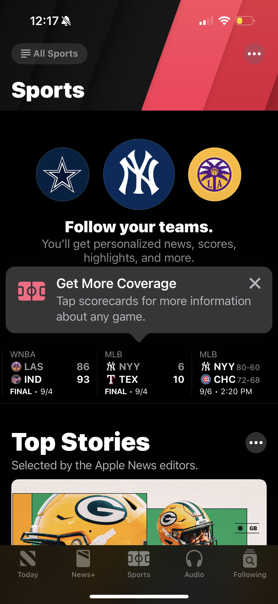
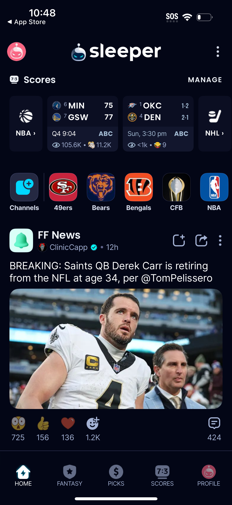
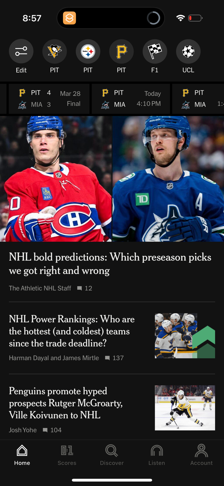
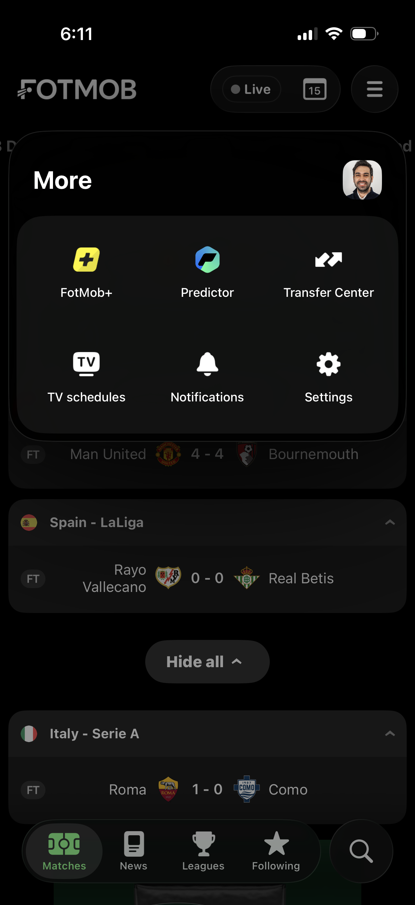
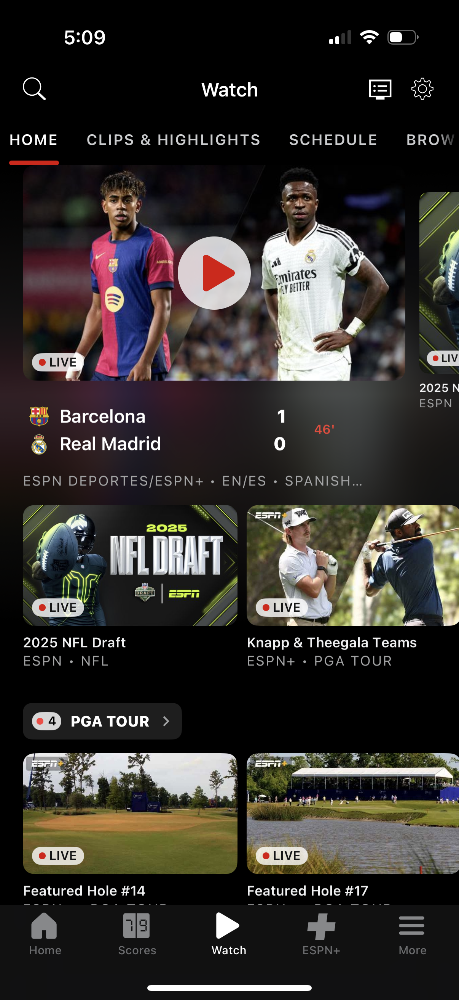
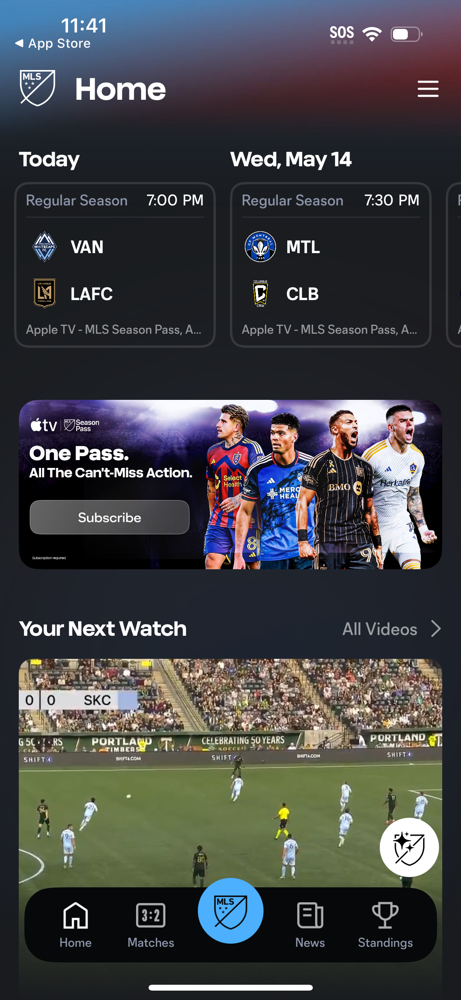
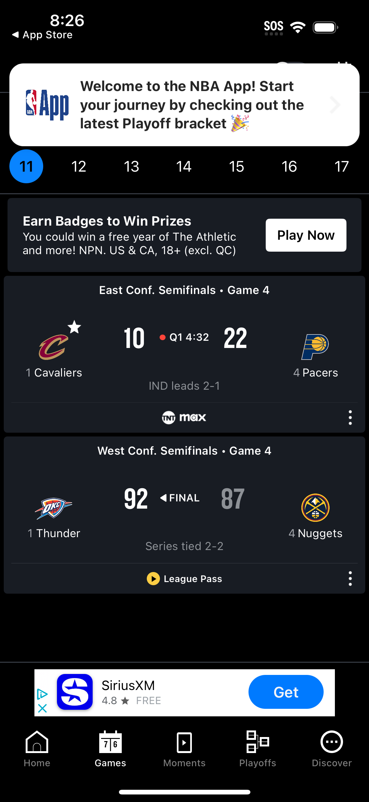
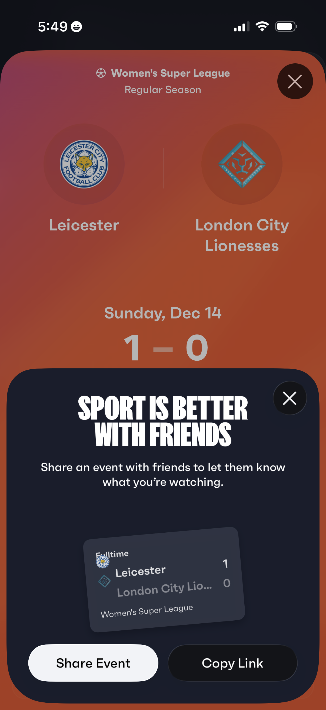
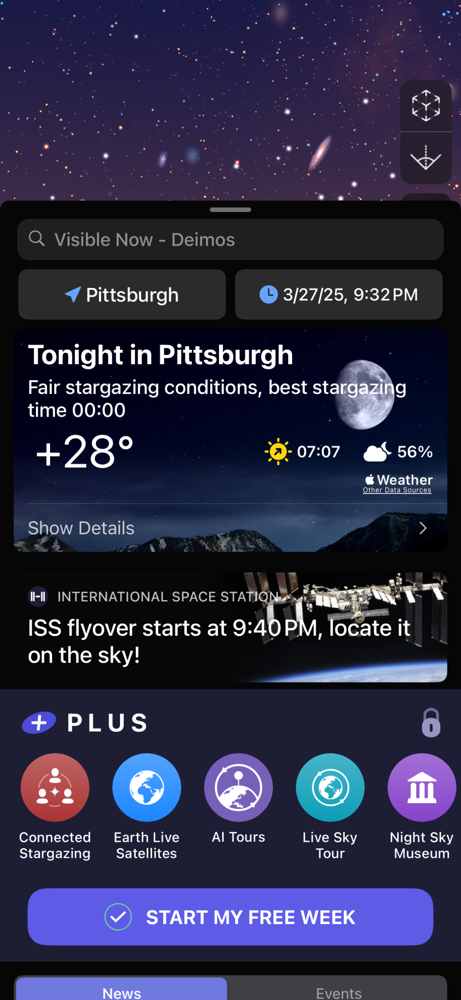
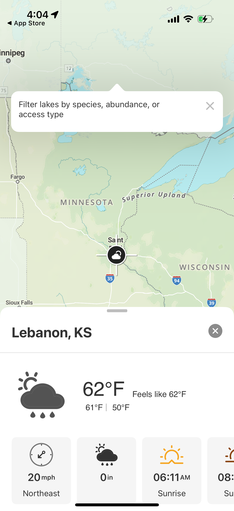

# Design Research: Sports App Home Screens & Surfing App Home Screens

## TL;DR

**Sports apps** have converged on a 3-layer home: a live score strip at the top → personalized feed in the middle → news/video at the bottom, all anchored by bold team branding. The #1 differentiator between good and great is **real-time feel** — score cards with LIVE badges, countdowns, and broadcast links that make the user feel plugged in even before a game starts.

**Surfing apps** (Surfline, MSW, Carrot Surf) don't appear in Lazyweb's DB in volume, so this section draws from adjacent outdoor/weather apps plus category knowledge. The #1 differentiator is **go/no-go clarity** — a single rating (star, rating bar, or color chip) that tells a surfer in 2 seconds whether it's worth paddling out, before they ever read a number.

For **Conatus specifically**: the existing BestWindowCalculator + on-device AI summary is a rare advantage. The home screen should lead with that signal — not raw numbers.

---

## Recommendations / Next Steps

### Sports App Home
1. **Pinned teams strip as the first scroll-stop** — horizontal chips at the top showing your followed teams' next game time + score/status. Every top sports app does this; it's table stakes.
2. **Hero card for the "most interesting" upcoming or live match** — full-width, team logos, start time with countdown, broadcast info. The Athletic and Fotmob nail this.
3. **News feed below the fold** — large hero images, author + comment count, filtered to followed sports. Users scan images, not headlines first.
4. **No empty states** — if no games today, show yesterday's results or tomorrow's schedule. Fixtured does a clear-day layout with a minimal card that still feels alive.

```
┌──────────────────────────────┐
│  🏄 Good afternoon, Seymen  │
├──────────────────────────────┤
│  ← [NBA] [NFL] [Surf] →     │  ← personalization strip
├──────────────────────────────┤
│                              │
│   HERO MATCH CARD            │  ← full-width
│   Lakers  vs  Celtics        │
│   LIVE  Q3  87–84   ESPN ▶  │
│                              │
├──────────────────────────────┤
│  Top Stories  ────────────── │
│  [img] Headline, author, 💬  │
│  [img] Headline, author, 💬  │
│  [img] ...                   │
└──────────────────────────────┘
```

5. **Bottom nav: 5 items max** — Home, Scores, Watch/Video, My Teams, More. Every app uses this structure.

### Surfing App Home (for Conatus)
1. **Lead with the go/no-go verdict** — a prominent rating badge (★★★ or "EPIC / GOOD / POOR") before any numbers. This is the #1 thing Surfline gets right. Conatus has BestWindowCalculator — surface it as the hero, not a footnote.
2. **AI summary as the subtitle** — 1–2 lines of on-device AI narrative ("2–3ft clean peaks, offshore winds until noon") directly under the rating. Users read this before they look at charts.
3. **Best window callout** — a time-chip ("Best: 7am – 10am") in the hero card, not buried in a chart.
4. **Hourly forecast strip below** — wave height bars, wind direction arrows, tide state. Scrollable. The Weather Channel home shows the right pattern for hourly strips.
5. **Multi-spot switcher** — horizontal chips for pinned spots. Let the user flick between spots in one tap without leaving the home screen.

```
┌──────────────────────────────┐
│  ← Ericeira Beach        ↕  │  ← spot switcher
│  ★★★ GOOD                   │  ← go/no-go verdict
│  "Clean 2–3ft, light offshore│
│   wind. Best window 7–10am" │  ← AI summary
│                              │
│  Best: 7am – 10am  🕐       │
├──────────────────────────────┤
│  ← 6am│7am│8am│9am│10am → │  ← hourly strip
│   2ft  3ft  3ft  2ft  1ft  │
│   ↙   ↙    ↙    ↗    ↗    │  ← wind arrows
├──────────────────────────────┤
│  [Log Session]  [View Map]   │  ← quick actions
├──────────────────────────────┤
│  📍 Nearby Spots ─────────── │
│  Praia do Norte  ★★ Fair    │
│  Supertubos      ★★★ Good  │
└──────────────────────────────┘
```

6. **Nearby spots list below** — shows 2–3 closest spots with their rating chip. Encourages exploration.

---

## Key Examples

### Sports App References


*Apple News — Sports home: "All Sports" filter chip, horizontal score card strip (live/final), then "Top Stories" news feed below. This 3-layer structure (filter → scores → content) is the gold standard. [Lazyweb]*


*Sleeper — Live game score cards (multiple leagues) at the top with a "Manage" button, then a social fantasy football news feed with reactions and social engagement. Shows how a feed can feel real-time without a full score board. [Lazyweb]*


*The Athletic — Large hero images dominate, with team/league horizontal strip at the very top for quick score access, then full-bleed story cards. The premium approach: journalism-first rather than scores-first. [Lazyweb]*


*Fotmob — Matches grouped by league, yesterday/today/tomorrow date navigation, LIVE badge, league sections that expand/collapse. Best-in-class fixture density without feeling cluttered. [Lazyweb]*


*ESPN — Match card with teams, live status, current score, and TV/streaming provider badge. The "Watch" CTA is integrated directly into the score card. [Lazyweb]*


*MLS — Upcoming match schedule with team logos and kickoff time, then "Your Next Watch" video section below. Shows how a league app layers schedule → video → news. [Lazyweb]*


*NBA — Live and completed matchup cards with team logos, score, quarter/time, series context, and broadcast links. Spoiler toggle is a nice touch. [Lazyweb]*


*Fixtured — Day-by-day fixture timeline, full-time score cards grouped by date, and a clear "no games today" state that still shows the next match. Excellent handling of empty schedule states. [Lazyweb]*

---

### Surfing / Outdoor Conditions References


*Night Sky — "Stargazing Conditions" card with a quality score, temperature, cloud cover, and a link to more detail. This is almost exactly the pattern Conatus needs for surf conditions: one card, one verdict, one link. [Lazyweb]*


*onX Fish — Map-based outdoor app showing a collapsible bottom sheet with conditions (temp, wind, precipitation, sunrise/sunset) for the selected spot. A great model for how Conatus could surface spot weather inline. [Lazyweb]*

---

## Patterns

### Sports App Patterns (universally shared)
- **Horizontal score strip or cards near the top** — every app (ESPN, NBA, Apple News, MLS, Sleeper) puts live/upcoming scores in the first visible zone
- **Team/league filter chips** — horizontal scroll of personalization selectors above the feed, not in a sidebar
- **Large hero images for news** — full-bleed photos, article title, author, comment count. Text-only cards are rare
- **LIVE badge + real-time polling** — a "LIVE" chip with red dot is universal; it's the signal users scan for first
- **Bottom tab: 5 items or fewer** — Home, Scores, Watch, [sport-specific], More/Profile
- **Dark mode first** — The Athletic, NBA, Sleeper, ESPN all skew dark or offer dark by default. Sports apps feel more intense/premium in dark

### Surfing/Outdoor Conditions Patterns (adjacent + domain knowledge)
- **Single-number quality rating** — Surfline uses 1–5 stars, MSW uses a colored bar. Users anchor on this before reading anything else
- **Swell/wind summary in plain English** — AI or templated narrative, not raw numbers
- **Hourly chart as the workhorse** — wave height + wind bars for the next 12–24h
- **Tidal context** — high/low tide markers on the hourly strip
- **Spot-switching without navigation** — tab or horizontal chip at the top
- **Condition freshness indicator** — timestamp ("Updated 3 min ago") is critical for trust in a real-time forecast

---

## Anti-Patterns

### Sports Apps
- **Walls of text scores** — apps that list 20 matches as plain rows with no visual hierarchy lose users immediately
- **Unauthenticated empty state** — showing nothing until you log in. Every top app shows public content first
- **Hamburger menus for core actions** — The Guardian's sports section uses a hamburger for sport navigation; it's buried and users miss it
- **Betting promos as the hero** — FanDuel and DraftKings lead with casino banners; non-betting sports apps that copy this layout signal distrust

### Surfing Apps
- **Leading with raw numbers** — showing "4.2ft @ 14s NNW" as the hero is meaningless to most surfers; it requires translation. Lead with the verdict, not the data
- **One-size-fits-all conditions** — what's "good" for a beginner is different from an advanced surfer. Conatus collected persona and height preference in onboarding — use it
- **Forecast beyond 5 days** — surfers don't trust 7-day surf forecasts. Showing them suggests the app doesn't know surfing culture
- **Generic weather UI** — using a standard weather app layout for surf conditions misses sport-specific needs (swell period, tide phase, wave type)

---

## Unique Angles

- **Sleeper's social layer on scores** — instead of just showing a score card, Sleeper injects community reactions (breaking posts, likes, comments) directly into the same feed. It makes scores feel alive even when no game is live
- **Night Sky's "Conditions for activity" card** — a single card that rates the night for stargazing (0–100 score, temp, cloud cover). This is a perfect analog for Conatus's surf quality card — one number, one tap to expand
- **Fixtured's "clear day" card** — when no games match the filter, it shows a minimal card that still shows the next upcoming fixture. It never goes blank
- **The Athletic's team strip + score hover** — tapping any team chip in The Athletic's top strip shows a mini scorecard without navigating away. Deep linking without losing context

---

## Findings

The Lazyweb DB has strong coverage of mainstream sports apps (ESPN, NBA, MLS, Sleeper, The Athletic, Fotmob) but zero dedicated surf forecasting apps. Surfline, Magic Seaweed, and Carrot Surf are not in the database as of this research date. This means surf-specific UI patterns must be inferred from:
1. Adjacent outdoor activity apps (onX Fish, Night Sky, AllTrails)
2. Weather apps that show conditions-based forecasts (The Weather Channel)
3. Domain knowledge of the surfing app landscape

The strongest insight for **Conatus home screen** is the Night Sky "conditions card" pattern — it's functionally identical to what a surf quality card should be. Night Sky shows: location, activity rating (quality score), a brief conditions summary, and a link to expand. That's exactly the right structure for a surf home screen hero.

For the sports portion: if Conatus ever adds a social/community layer (surf sessions, spots logged by friends), Sleeper's model of mixing live scores with a social feed is the template to follow.

---

## Sources

- Lazyweb database: Apple News, Sleeper, The Athletic, Fotmob, ESPN, MLS, NBA, Fixtured (sports category)
- Lazyweb database: Night Sky, onX Fish, Any Distance (adjacent outdoor/activity apps)
- Domain knowledge: Surfline, Magic Seaweed (MSW), Windy, Carrot Surf — not in Lazyweb DB, referenced from product knowledge
